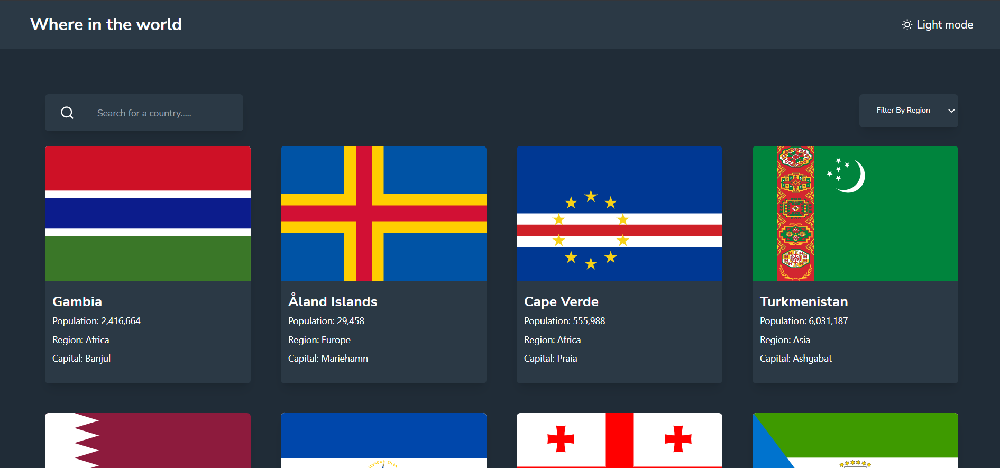

# Frontend Mentor - REST Countries API with color theme switcher solution

This is a solution to the [REST Countries API with color theme switcher challenge on Frontend Mentor](https://www.frontendmentor.io/challenges/rest-countries-api-with-color-theme-switcher-5cacc469fec04111f7b848ca). Frontend Mentor challenges help you improve your coding skills by building realistic projects. 

## Table of contents

- [Overview](#overview)
  - [The challenge](#the-challenge)
  - [Screenshot](#screenshot)
  - [Links](#links)
- [My process](#my-process)
  - [Built with](#built-with)
  - [What I learned](#what-i-learned)
  - [Continued development](#continued-development)
  - [Useful resources](#useful-resources)
- [Author](#author)
- [Acknowledgments](#acknowledgments)

## Overview

### The challenge

Users should be able to:

- See all countries from the API on the homepage
- Search for a country using an `input` field
- Filter countries by region
- Click on a country to see more detailed information on a separate page
- Click through to the border countries on the detail page
- Toggle the color scheme between light and dark mode *(optional)*

### Screenshot

### Links

- Solution URL: [https://www.frontendmentor.io/solutions/restcountriesapichallenge--TazA-r5t2](https://www.frontendmentor.io/solutions/restcountriesapichallenge--TazA-r5t2)
- Live Site URL: [https://countries-api-challenge.netlify.app/](https://countries-api-challenge.netlify.app/)

### Built with

- Semantic HTML5 markup
- Mobile-first workflow
- [Tailwind CSS](https://tailwindcss.com) - CSS framework
- [React](https://reactjs.org/) - JS library
- [Rest Countries API](https://restcountries.com/) -REST Countries API is a simple REST API from RapidAPI that provides information about countries in the world In JSON format

### What I learned
- I used this challenge to get better with Tailwind CSS
- How to search and filter from an API
- How to make use of useParams to pass a parameter 
- How to work with APIs
- How to toggle dark mode and light mode with tailwind css in react

## Author

<!-- - Website - [Ojara](http://ojaraa.netlify.app/) -->
- LinkedIn - [Okereke Favour Ojara](https://www.linkedin.com/in/okereke-favour-230234198)
- Frontend Mentor - [@Ojara27](https://www.frontendmentor.io/profile/Ojara27)
- Twitter - [@ojarraa](https://www.twitter.com/ojarraa)

